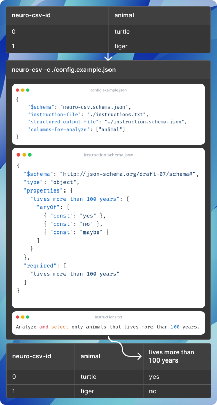

# [draft] neuro-csv

A CSV postprocessor.

## Why?

I couldn't find a free solutions that implement something like [COPILOT function](https://techcommunity.microsoft.com/blog/microsoft365insiderblog/bring-ai-to-your-formulas-with-the-copilot-function-in-excel/4443487) from Excel. Like, you must have Excel, and probably some subscription for AI.

## Requirements

- Work with any CSV file.
- Work with LM Studio as AI frontend
- Have ability to specify which columns have to be sended to AI
- Have a userfriendly JSON configuration file with JSON schema.
- Have a userfriendly CLI
- Have a JSON schema interface for structured output direct into columns

## Recomendations

- By my opinion current best local AI for reasoning tasks in russian is google/gemma-3-27b